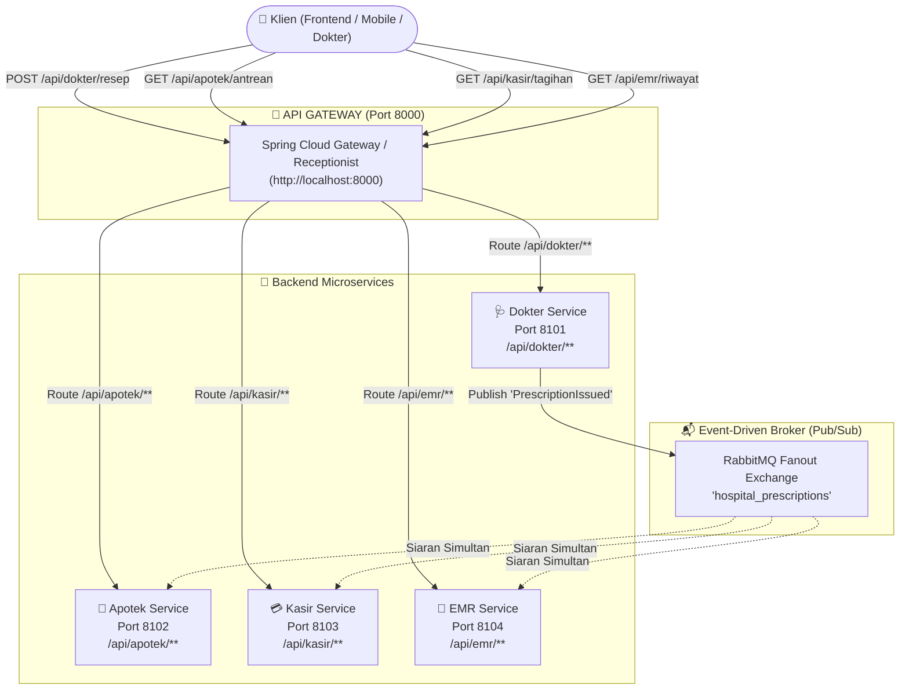

# Implementasi API Gateway & Pub/Sub: Sistem Terdistribusi Layanan Kesehatan (Rumah Sakit)
**Mata Kuliah: Sistem Terdistribusi - Fakultas Ilmu Komputer, Universitas Jember (2025/2026)**  
**Dosen Pengampu: M. Zarkasi, S.Kom., M.Kom.**

---

## 👥 Kelompok 2
- **Ridho Rizky Prasetyo** (242410102055)
- **Firsandi Andraw F.** (242410102056)
- **Ahmad Rafif Nandra U.** (242410102018)

---

## 📌 Studi Kasus: Kasus C (Sistem Layanan Kesehatan / Rumah Sakit)
> **Rumusan Masalah:**  
> *"Ketika dokter menyelesaikan resep obat di poli klinik, data resep harus diketahui oleh **Apotek** (untuk penyiapan obat & stok), **Kasir** (untuk rincian tagihan), dan **Rekam Medis (EMR)** (untuk histori pasien) secara bersamaan."*

---

## 💡 Korelasi dengan Materi Perkuliahan (Slide PPT Dosen)

### 1. Masalah Akses Langsung (*Direct Access*) — Slide 2 & 3 PPT
Sebelum diterapkannya API Gateway:
- Klien (web browser, mobile app, frontend dokter) harus mengakses setiap service secara langsung menggunakan alamat IP dan port yang berbeda-beda:
  - Dokter Service: `http://localhost:8101`
  - Apotek Service: `http://localhost:8102`
  - Kasir Service: `http://localhost:8103`
  - EMR Service: `http://localhost:8104`
- **Kelemahan fatal**:
  1. *Developer frontend/mobile* repot karena harus mengingat dan mengelola banyak endpoint & port.
  2. Struktur internal backend bocor ke publik.
  3. Autentikasi, otorisasi, dan rate limiting sulit diterapkan secara konsisten.
  4. Perubahan port internal service akan langsung merusak aplikasi klien.

### 2. Solusi: Akses Terpusat Melalui API Gateway (*Single Entry Point*) — Slide 4 & 5 PPT
- API Gateway bertindak seperti seorang **"Receptionist"** di lobi rumah sakit:
  - Klien **HANYA** berbicara ke satu pintu gerbang tunggal: `http://localhost:8000`.
  - Gateway memeriksa rute (`predicates`) lalu meneruskan (*proxy forwarding*) request ke microservice yang tepat di balik sistem.

### 3. Implementasi Mengacu Contoh Dosen (Slide 8 & 9 PPT)
Di Slide 8 dan repositori [mohammadzarkasi/sister-2024-2025-02](https://github.com/mohammadzarkasi/sister-2024-2025-02), implementasi menggunakan **Spring Cloud Gateway**. 

Pada proyek ini, file konfigurasi [application.yml](file:///home/firsandia/Desktop/coba/gateway/src/main/resources/application.yml) diadaptasi langsung ke Studi Kasus Rumah Sakit:
```yaml
server:
  port: 8000

spring:
  application:
    name: HOSPITAL-GATEWAY-SERVICE
  cloud:
    gateway:
      routes:
        - id: dokter-service
          uri: http://localhost:8101
          predicates:
            - Path=/api/dokter/**

        - id: apotek-service
          uri: http://localhost:8102
          predicates:
            - Path=/api/apotek/**

        - id: kasir-service
          uri: http://localhost:8103
          predicates:
            - Path=/api/kasir/**

        - id: emr-service
          uri: http://localhost:8104
          predicates:
            - Path=/api/emr/**

logging:
  level:
    org.springframework.cloud.gateway: DEBUG
```

> **Catatan Polyglot Microservices:**  
> Spring Cloud Gateway (Java) berjalan sebagai gerbang HTTP di port 8000, sedangkan microservice di belakangnya (Dokter, Apotek, Kasir, EMR) berjalan secara *language-agnostic* (REST API). Klien tidak pernah tahu bahasa pemrograman apa yang dipakai di backend!

---

## 🏛️ Arsitektur Sistem Terdistribusi



---

## 📂 Struktur Proyek

```text
coba/
├── gateway/                        # [Acuan Slide 8 PPT] Spring Cloud Gateway (Java Maven)
│   ├── pom.xml                     # Konfigurasi dependency Spring Boot & Cloud Gateway
│   ├── mvnw / mvnw.cmd             # Maven Wrapper (tanpa perlu install maven)
│   ├── Dockerfile                  # Opsi build & run instan via Docker
│   └── src/main/
│       ├── java/id/rs/gateway/HospitalGatewayApplication.java
│       └── resources/application.yml  # Definisi 4 Rute Service Rumah Sakit
├── python_gateway/                 # [Alternatif Ringan] Python Reverse Proxy Gateway
│   └── gateway.py                  # Port 8000 (Single Entry Point)
├── services/                       # 4 Microservices Rumah Sakit
│   ├── config.py                   # Konfigurasi RabbitMQ & Network Resilient
│   ├── dokter_service.py           # Port 8101: REST API + Publisher Event Resep
│   ├── apotek_service.py           # Port 8102: REST API + Subscriber Racik Obat & Stok
│   ├── kasir_service.py            # Port 8103: REST API + Subscriber Billing Tagihan
│   └── emr_service.py              # Port 8104: REST API + Subscriber Arsip Rekam Medis
├── simulasi_gateway.py             # Runner otomatis untuk demonstrasi & pengujian
├── requirements.txt                # Dependensi Python
└── README.md                       # Dokumentasi arsitektur & panduan praktikum
```

---

## 🚀 Panduan Menjalankan Sistem

### Cara 1: Demonstrasi Cepat Otomatis (Satu Perintah)
Skrip ini akan menyalakan semua microservices dan API Gateway, lalu mengeksekusi skenario uji coba lengkap dari pembuatan resep hingga pembayaran:
```bash
python3 simulasi_gateway.py
```

---

### Cara 2: Menjalankan Per Komponen Secara Mandiri

#### 1. Menjalankan Microservices Backend (Buka 4 Terminal):
- **Terminal 1 (Dokter Service - Port 8101):**
  ```bash
  python3 services/dokter_service.py
  ```
- **Terminal 2 (Apotek Service - Port 8102):**
  ```bash
  python3 services/apotek_service.py
  ```
- **Terminal 3 (Kasir Service - Port 8103):**
  ```bash
  python3 services/kasir_service.py
  ```
- **Terminal 4 (EMR Service - Port 8104):**
  ```bash
  python3 services/emr_service.py
  ```

#### 2. Menjalankan API Gateway (Port 8000):
Pilih salah satu:
- **Opsi A (Spring Cloud Gateway - Java, Persis Slide 8 PPT):**
  ```bash
  # Menggunakan Docker
  docker run -it --rm --network="host" -v $(pwd)/gateway:/app -w /app eclipse-temurin:21-jdk ./mvnw spring-boot:run
  ```
- **Opsi B (Python Gateway - Ringan & Cepat):**
  ```bash
  python3 python_gateway/gateway.py
  ```

---

## 🧪 Contoh Pengujian API (cURL ke Port 8000)

Perhatikan bahwa seluruh perintah cURL di bawah ini **HANYA ditujukan ke port 8000 (API Gateway)**:

### 1. Terbitkan Resep Baru dari Dokter
```bash
curl -X POST http://localhost:8000/api/dokter/resep \
  -H "Content-Type: application/json" \
  -d '{
    "prescription_id": "RX-2026-8801",
    "patient_id": "RM-55001",
    "patient_name": "Tn. Bambang Pamungkas",
    "doctor": "dr. Budi Santoso, Sp.JP",
    "medicines": [
      {"name": "Amlodipine 10mg", "qty": 30, "price": 45000},
      {"name": "Bisoprolol 5mg", "qty": 30, "price": 90000}
    ],
    "total_meds": 135000,
    "doctor_fee": 150000
  }'
```

### 2. Cek Antrean Obat di Apotek
```bash
curl http://localhost:8000/api/apotek/antrean
```

### 3. Cek Tagihan di Kasir
```bash
curl http://localhost:8000/api/kasir/tagihan
```

### 4. Cek Histori Pasien di EMR (Rekam Medis)
```bash
curl http://localhost:8000/api/emr/riwayat
```

### 5. Bayar Tagihan di Kasir
```bash
curl -X POST http://localhost:8000/api/kasir/bayar/RX-2026-8801
```

---

## 🏆 Kesimpulan & Poin Evaluasi Dosen
1. **Single Entry Point**: Klien hanya perlu mengakses port 8000, mempermudah tim frontend dan meningkatkan keamanan backend (Slide 4 & 5).
2. **Dekoupling Arsitektur**: Layanan Apotek, Kasir, dan EMR tidak terikat langsung ke Dokter; mereka menerima data secara serempak melalui event Fanout RabbitMQ (Studi Kasus C).
3. **Kesesuaian PPT**: Mengikuti arsitektur **Spring Cloud Gateway** pada Slide 8 dan referensi dosen [sister-2024-2025-02](https://github.com/mohammadzarkasi/sister-2024-2025-02).
